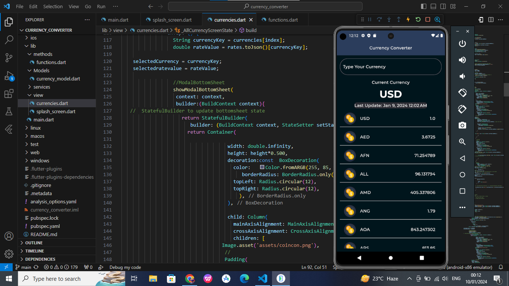
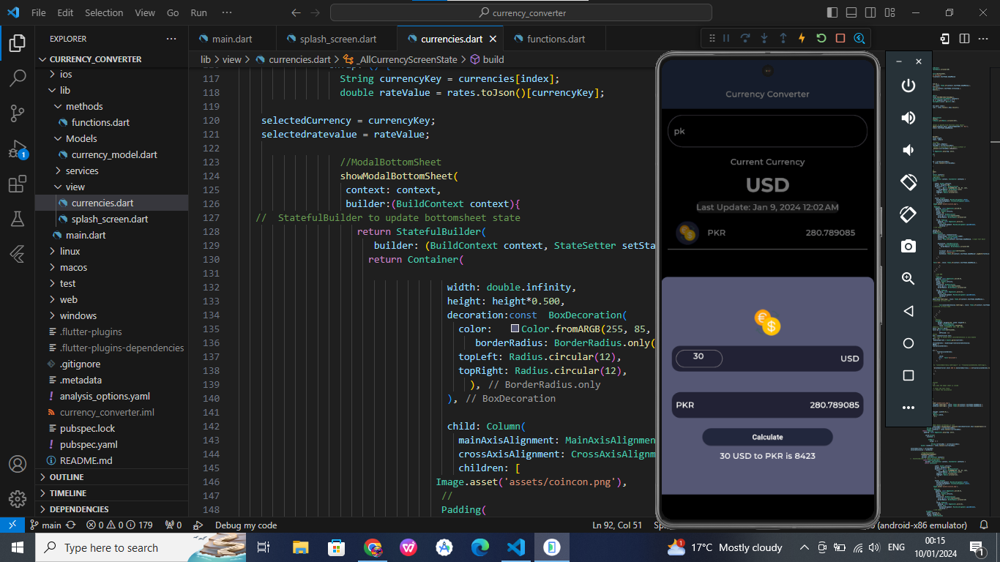
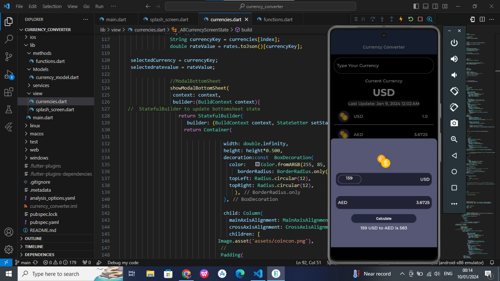
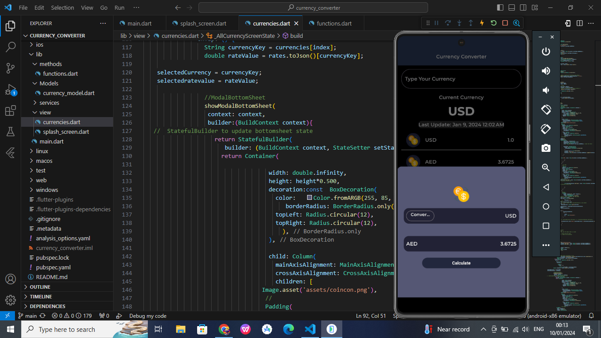
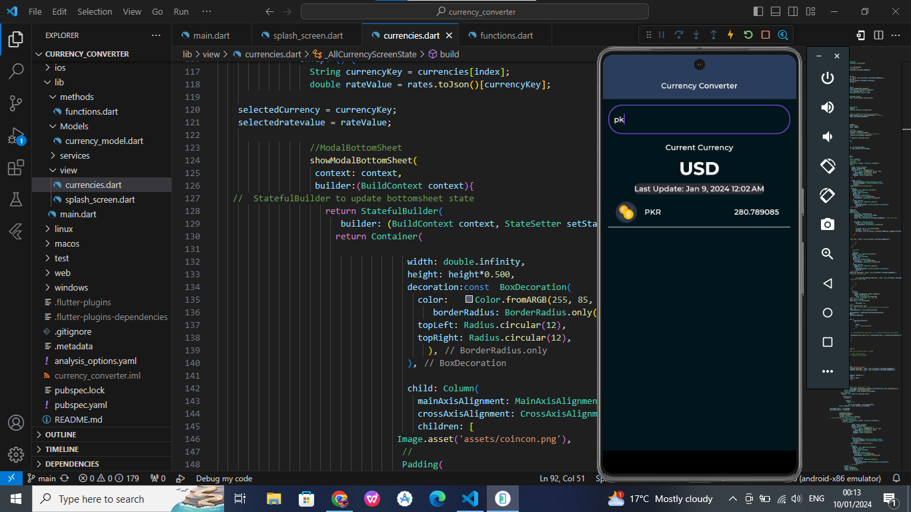

# Currency Converter App       

## Overview

Welcome to the Currency Converter App, a powerful tool designed to simplify currency conversions right at your fingertips. This Flutter-based mobile application allows users to effortlessly convert currencies, providing accurate and up-to-date exchange rates.

## Features

- **Real-Time Conversion:** Access live exchange rates for accurate currency conversion.
- **Multiple Currencies:** Support for a wide range of currencies, making it a versatile tool for global users.
- **User-Friendly Interface:** Intuitive design for a seamless and straightforward user experience.
- **Search Function:** Search all currencies across world.

## Screenshots

## How to Use

1. **Installation:**
   - Clone the repository.
   - Install dependencies using `flutter pub get`.

2. **Run the App:**
   - Use `flutter run` to launch the application on your emulator or connected device.

3. **Currency Conversion:**
   - Select the source and target currencies.
   - Enter the amount to convert.
   - View the converted amount instantly.

## Technologies Used

- Flutter
- Dart

## Contributions

We welcome contributions from the community to enhance the app's functionality, add new features, or improve the user interface. If you have ideas or improvements, please feel free to submit a pull request.

Happy converting! 🌍💱
